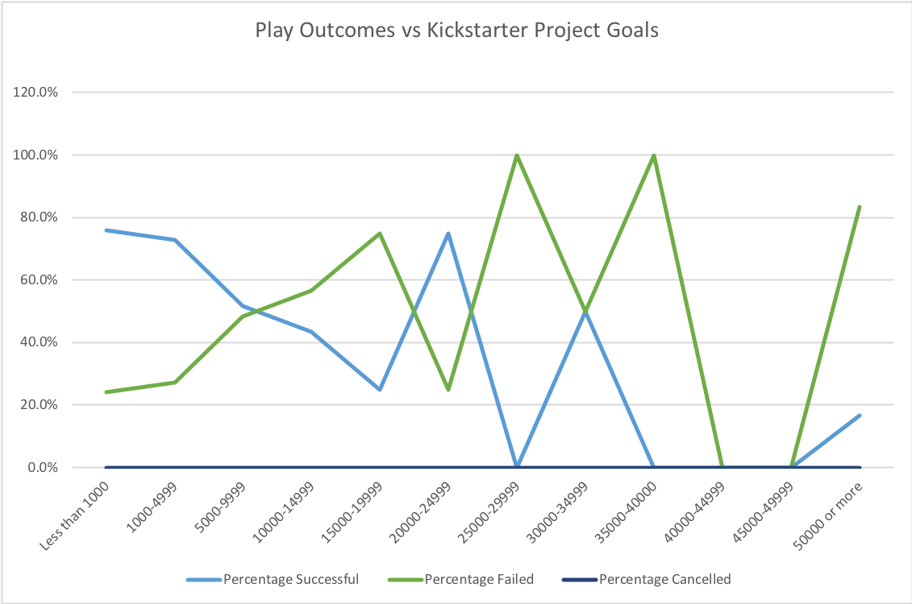

# Kickstarting with Excel

## Overview of Project

This project was an analysis of the kickstarter campaign data in order to determine relationships between the funding goals of the projects and the launch date and the outcomes of the project.

### Purpose
The purpose is to deliver to the client usable charts and organized data to better understand the how funding goals, as well as launch date, are related to success of projects.

---

## Analysis and Challenges

### Analysis of Outcomes Based on Launch Date
The Analysis of Outcomes Based on their Launch date was done using a pivot table that filtered the data for date Launched and plotted against the outcome as can be seen in the screenshot below.

It was then charted in a Line Chart:

The result was that plays thgat were launched in early summer had the highest number of successful outcomes; slowly tapering as the year moved toward fall.

---

### Analysis of Outcomes Based on Goals

In this section of the analysis, the COUNTIFS() function was used extensively to determine the nubmer of campaigns that had the desired outcome in each category based on their funding goals. Then the SUM() function was used to count the totals. Then the percentages were calculated. 

This resulted in the following chart when the Goal ranges were plotted against the Percentage of desired outcomes:

### Challenges and Difficulties Encountered

I encountered challenges with the COUNTIFS() function syntax. And, although it was returning numbers that seemed valid, I am skeptical of their validity because I have no way of checking them. 

---

## Results

- Two conclusions that can be drawn from **Outcomes based on Launch Date** are:
  - Successful campaigns seem to be launched in the summer
  - There seem to be other factors at play that determine the outcome of a campaign because there are successful campaigns all year long, as well as failed ones.  

- We can conclude from the **Outcomes based on Goals** that having a goal of less than $5000 historically has an around 75% success rate. And that the success rate dramatically drops as the goal amount increases.

- Limitations of the Data Set
  - This data set is limited by its timeline. It might not be the entire amount of data that has been collected 
  - We don't know anything about the success of the projects, just whether they were funded or not
  

- Some other possible tables could be
  - Outcome by Campaign timeline
  - Outcome by Country
  - Length of Blurb (Number of Characters) by outcome
  - Outcome by Spolight (TRUE or FALSE)

